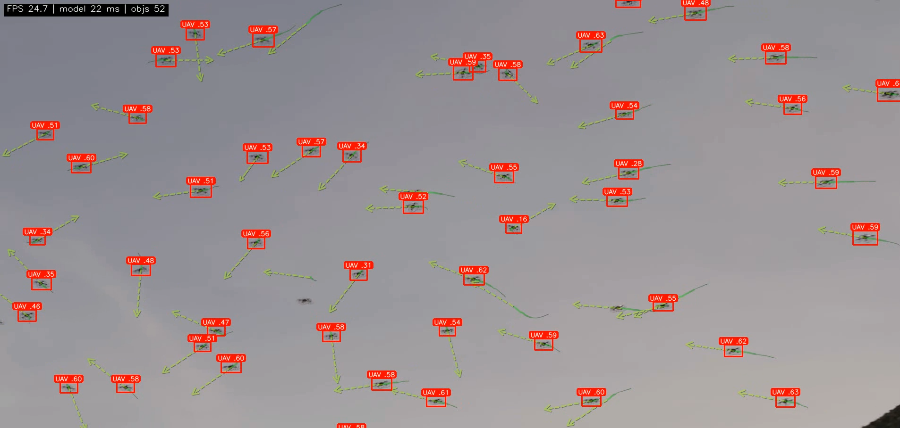

# Drone Detection – Inference README



This inference was done in a single A100 GPU. Achieved an average of 24FPS.

## What this is

A fast, single-file video inference pipeline that:

* runs a fine-tuned **Ultralytics YOLO** model,
* tiles each frame into 640×640 crops and **batches them through one model call**,
* merges detections back, applies **class-agnostic NMS**,
* assigns persistent IDs with a **simple IoU tracker**, and
* draws **red boxes**, compact labels, history **trails** and a dashed **motion prediction**,
* overlays a live **HUD**: `FPS | model ms | objs`.

Everything lives in `inference.py` so it’s easy to run and tweak.

---

## Repository layout

```
.
├── inference.py          # everything described above (run this)
├── requirements.txt      # pinned runtime deps
├── anduril_swarm.mp4     # example input (you provide)
└── yolov11n-UAV-finetune.pt  # your trained weights
```

## Requirements
- numpy : 1.26.4
- scipy : 1.11.4 
- opencv: 4.11.0
- torch : 2.7.0 

---
## Quick start

```bash
# Install runtime deps (CUDA-ready PyTorch assumed on the machine)
pip install -r requirements.txt

# Put your input paths in inference.py line 34-35 (or pass full paths)
#    - anduril_swarm.mp4
#    - yolov11n-UAV-finetune.pt

# 4) Run
python inference.py
```
**Outputs**

* `anduril_swarm-result.mp4` (same fps/size as the input)
* A periodic console log like:

  ```
  [60 frames] pipeline FPS (avg): 19.1 | window FPS: 24.7 | model: 22.4 ms
  ```
---

## How it works (high level)

### 1) Model setup

On import we load and place the YOLO model on GPU, fuse Conv+BN, enable FP16 where possible, allow TF32 and cuDNN benchmarking for best kernel selection.

```python
MODEL = YOLO(SOURCE_WEIGHTS_PATH)
MODEL.to("cuda:0")
MODEL.fuse()
MODEL.model.half()   # try FP16
```

Threading is pinned to avoid CPU over-subscription (lines 11-15):

* OpenCV threads: `cv2.setNumThreads(0)`
* PyTorch intraop: `torch.set_num_threads(1)`
* BLAS/NumExpr threads are set to `1` via env vars.

### 2) **Batched tiling inference** (`batched_infer`)

Large frames are split into 640×640 tiles, zero-padded on borders.
All tiles for a frame are passed **as a Python list** to `MODEL(...)`, which Ultralytics treats as a batch and executes **in one forward pass** on the GPU. That gives far better GPU utilization than calling the model tile-by-tile.

Steps:

1. **Tile**: `_tile_frame(frame, (640, 640)) → (tiles, offsets)`
2. **One batched forward**:

   ```python
   with torch.inference_mode():
       results = MODEL(tiles, device=0, half=True, conf=conf, verbose=False)
   ```
3. **Un-tile (merge)**: Convert each tile’s result to `sv.Detections`, shift boxes by its `(x, y)` offset back into full-frame coordinates, and concatenate.
4. **Merge duplicates**: run a tiny **class-agnostic CPU NMS** (`_nms_numpy`) with `iou_merge` (default 0.30) to remove overlaps between adjacent tiles.
5. Return a single `sv.Detections` object for the full frame + **strict model time** (GPU forward only) used for the HUD.

Why this is fast:

* One kernel launch/batch per frame instead of N launches for N tiles.
* Good memory locality and vectorization in YOLO forward.
* Keeps Python overhead and CPU↔GPU sync to a minimum.

### 3) **Simple IoU Tracker**

A lightweight, dependency-free tracker that assigns persistent IDs using only bounding box overlap:

1. **IoU matrix** between live tracks and current detections.
2. **Optional class gating**: if available, only match track↔det of the same class.
3. **Assignment**:

   * If SciPy is present: **Hungarian** on cost `(1 − IoU)` then drop pairs below `iou_thresh`.
   * Else: greedy pick highest IoU pairs until no pair exceeds `iou_thresh`.
4. **Update matched tracks**: write new bbox, reset `misses`, increment `hits`.
5. **Age unmatched tracks**: `misses += 1`, delete if `misses > max_age`.
6. **Create new tracks** for unmatched detections.
7. **Write back** `tracker_id` into `sv.Detections` so renderers and the trail logic can use it.

This gives stable IDs at very low cost—perfect when you don’t need re-ID or appearance models.

### 4) **Trails + prediction**

`TrailMemory` keeps, for each `tracker_id`:

* last bbox, last center `(cx, cy)`,
* an **EMA velocity** `(vx, vy)` (clamped to avoid wild jumps),
* a short **history deque** (default 14 points).

On each frame it:

* appends the new center,
* updates velocity with EMA,
* prunes stale tracks (no updates for `max_age` frames).

`draw_trails_and_prediction(...)` then:

* draws the **history trail** with a subtle fade,
* draws a **dashed prediction vector** along the smoothed velocity with a small arrowhead.

### 5) Overlay & telemetry

* **Boxes**: solid **red**.
* **Labels**: small pill (top-center), “`UAV .58`” style.
* **HUD**: top-left text shows rolling **window FPS**, average **model ms**, and **object count**.
* `FPSMeter` keeps two rolling windows: full pipeline time/frame and model-only time, and logs every 60 frames.

---

## Tuning

* **Confidence threshold** (per-tile): change `conf` in `batched_infer(frame, conf=0.15, ...)`.
* **Tile merge NMS**: adjust `iou_merge` (default `0.30`).
* **Tracker**:

  * `iou_thresh`: matching strictness (default `0.3`).
  * `max_age`: how many missed frames before a track is dropped (default `30`).
  * `class_aware=True/False`.
* **Trails**:

  * `history_len`, `ema_alpha`, `max_step` to smooth or lengthen trails/prediction.
* **Performance**:

  * Keep the **tile size** at or below your model’s native size (640 here).
  * Ensure **FP16** is truly active (A100/RTX support it).
  * Use **fast storage**; video decoding can bottleneck overall FPS.
  * If CPU decoding is a bottleneck, transcode the source with fewer B-frames or try a lower CRF.

---

## Why not DeepSORT/ByteTrack etc.?

This pipeline favors **simplicity, speed, and zero extra dependencies**. The Simple IoU Tracker works well for small UAVs with decent fps where appearance cues are weak; trails and EMA prediction add temporal context without heavy models. If you later need re-ID or occlusion robustness, you can drop in a stronger tracker—the rest of the pipeline stays unchanged.

---

## Troubleshooting

* **Low FPS but low GPU util**
  Increase batch size implicitly by using larger frames / more tiles, ensure FP16 is enabled, and keep the logger `verbose=False`. IO/decoding can also dominate—try re-encoding the input with `-crf 23` and fewer B-frames.

* **Memory errors**
  Lower input resolution or tile size; or raise `iou_merge` to reduce duplicate boxes after merging.

* **No labels / class names**
  If your weights don’t carry names, we fall back to `"OBJ"`; otherwise we read `MODEL.names` / `MODEL.model.names`.

---

## License

This README describes `inference.py`. See the upstream licenses for Ultralytics YOLO and Supervision.

---
